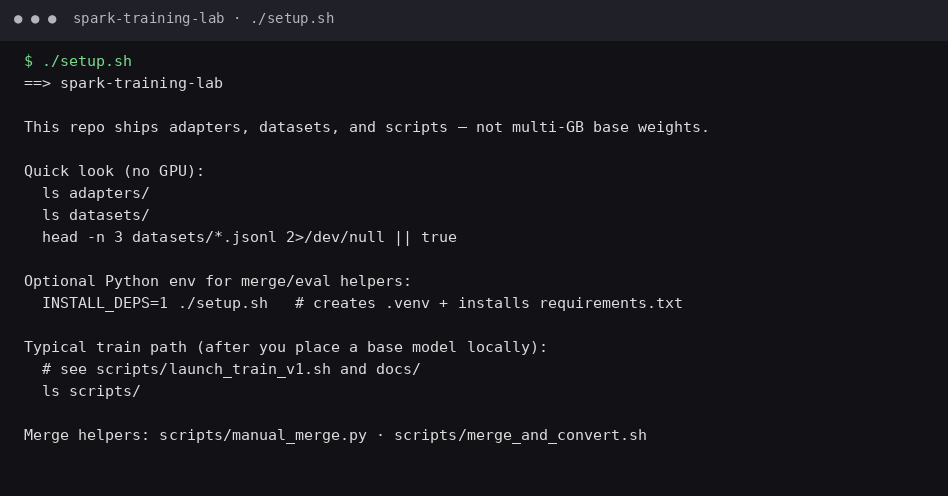

# Spark Training Lab




LoRA / QLoRA **lab for NVIDIA DGX Spark**: datasets, merge/eval scripts, and PEFT adapter **configs**.

Trained LoRA weights, run logs, and metrics stay **local** (not in this repo). Multi-GB base weights and merged GGUFs are also **not** in git (rebuild locally).

## At a glance

| | |
|---|---|
| **What it is** | A **LoRA/QLoRA training lab** for DGX Spark: datasets, merge/eval scripts, and adapter configs. Trained weights and run metrics are **not** in git. |
| **What it’s for** | Safe, small fine-tunes without dumping checkpoints into GitHub — ship methods + datasets; train and save adapters on the machine that has a base model. |
| **How to use it** | `./setup.sh` to orient; browse `adapters/` (configs only) + `datasets/`. When you have a base model: `INSTALL_DEPS=1 ./setup.sh`, then follow `scripts/` and `docs/`. |

## Try it (pick one)

### One command
```bash
git clone https://github.com/Coinupbtc/spark-training-lab.git
cd spark-training-lab && ./setup.sh
```

### Copy-paste (browse only — no GPU)
```bash
git clone https://github.com/Coinupbtc/spark-training-lab.git && cd spark-training-lab
ls adapters datasets scripts
./setup.sh
```

### Train (when you have a base model)
```bash
INSTALL_DEPS=1 ./setup.sh
# put / point at your base weights, then follow scripts/ + docs/
ls scripts/
```

## What is / is not

| Do | Don't |
|----|-------|
| LoRA/QLoRA on 7B–35B class models | Expect trained LoRA weights, metrics, or multi-GB bases in git |
| Small curated datasets (100–5k examples) | Dump unfiltered private corpora |
| Eval fixed prompts before/after | Ship an adapter with no smoke test |

## Layout

| Path | What |
|------|------|
| `adapters/` | PEFT `adapter_config.json` + notes (no weight files in git) |
| `datasets/` | JSONL train/eval |
| `scripts/` | Prepare, train, merge, eval |
| `runs/` | Local logs / metrics (not committed) |
| `docs/` | Runbooks |
| `setup.sh` | One-command orientation |

## Related

- [miaai35-tune](https://github.com/Coinupbtc/miaai35-tune) — measured llama.cpp serving tune
- [zwell-bench](https://github.com/Coinupbtc/zwell-bench) — bakeoff harness
- [spark-console](https://github.com/Coinupbtc/spark-console) — local GPU/fleet UI


## License

MIT
